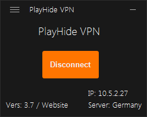

# PlayHide (Beta)

Build with Autoit & host in EU

## Features
- Play Games with LAN mode
- Share private files
- Host every Service 
- Be in a private Network like LAN

_*Only Client to Client / no Traffic Gateway_

### Pro:
- No Ads
- No Logs
- No Spyware
- Auto Updates
- One click to Play.
- Simple Setup/UI
- No Port forwarding needed
- No Account or Registration required 
- Full Open Source with OpenVPN

### Kontra:
- No Chats include like Tunngle
- No fixed IP (possible on Request)

_Tested with Call of Duty WWII & other Games under Windows 7 / 10 / 8.1_

## Installation
1. Install as Admin
2. Setup will start / Tap Driver installer (*needed)
3. Click Connect to join into the VPN Network

## Issues / Troubleshooting?
- Make sure your 3rd party Firewall get access to Port 1400 as UDP (only Windows Firewall tested)
- The Metric musst be 1 on the Tap Interface normal by Install Script will set it.
- More Ethernet Devices could be issue *currently not tested.
- Make sure only one Ethernet & no other VPN Client are running. (Metric conflict)
- Connection Limit from Subnet (254 Clients)
